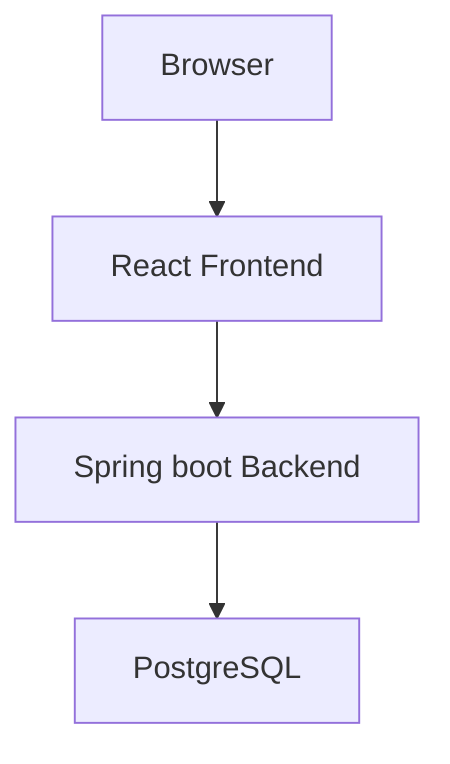
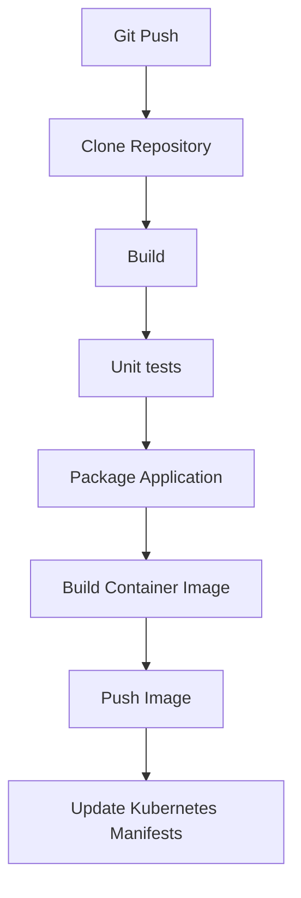
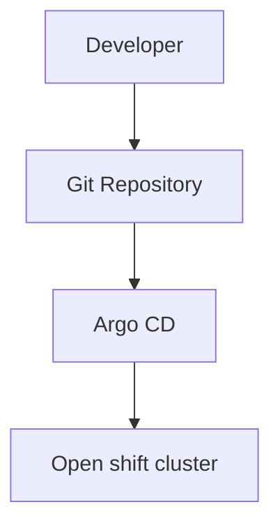
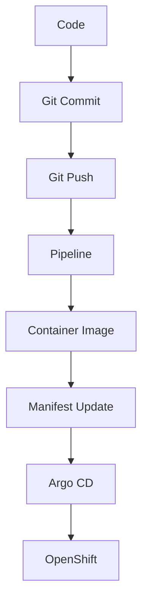

# BookStore Platform Architecture

## Project Architecture Specification

Version: 1.0

---

# Overview

BookStore Platform is the reference application used throughout the entire book.

The application evolves chapter by chapter while maintaining the same business domain.

The goal is to demonstrate how a modern cloud-native application is designed, containerized, 
deployed, automated and operated using Kubernetes, OpenShift and GitOps.

The business functionality remains intentionally simple.

The infrastructure becomes progressively more sophisticated.

---

# Architecture Principles

The project follows these principles:

- Single business domain
- Progressive evolution
- Cloud-native design
- Infrastructure as Code
- GitOps
- Production-inspired architecture
- Local-first development

The application must remain deployable on localhost throughout the entire book.

Cloud providers are intentionally excluded.

---

# Technology Stack

## Frontend

Technology

- React
- TypeScript
- Vite

Responsibilities

- User interface
- Authentication
- Book management
- Order management
- API consumption

Communication

REST API over HTTP.

---

## Backend

Technology

- Java
- Spring Boot
- Spring Data JPA
- Spring Security
- Maven

Responsibilities

- Business logic
- REST API
- Database access
- Validation
- Authentication
- OpenAPI documentation

---

## Database

Technology

PostgreSQL

Responsibilities

- Persistent storage
- Transactions
- Relational model

Future chapters may introduce:

- Read replicas
- Backup strategies
- Persistent Volumes

---

# Initial System Architecture



---

# Repository Layout

```
bookstore-platform/

frontend/

backend/

database/

docker/

kubernetes/

helm/

openshift/

tekton/

argocd/

docs/
```

Every directory has a single responsibility.

Documentation must never be mixed with application code.

---

# Kubernetes Architecture

Starting from Chapter 2 the application will be deployed using Kubernetes resources.

Each component will have:

Deployment

Service

Labels

Selectors

Namespace

Later chapters introduce:

ConfigMap

Secret

PersistentVolume

PersistentVolumeClaim

Ingress (when applicable)

---

# OpenShift Architecture

OpenShift replaces the local Kubernetes environment while preserving the application.

Additional resources include:

Project

Route

ImageStream (where appropriate)

BuildConfig (historical context only, where appropriate)

Security Context Constraints (SCC)

The application architecture should remain unchanged.

Only the platform capabilities evolve.

---

# Helm Architecture

The entire application will eventually be packaged as a single Helm Chart.

```
helm install bookstore
```

The chart should support configurable values including:

- Namespace
- Image versions
- Replica count
- Resource limits
- Service configuration

The goal is to make deployments repeatable and configurable.

---

# Tekton Architecture

The CI pipeline will be implemented using Tekton.

Pipeline stages:



Pipeline definitions must be stored inside the repository.

---

# Argo CD Architecture

Continuous Delivery follows the GitOps model.



Argo CD continuously compares:

Desired State

vs

Current State

Differences are automatically reconciled.

Manual changes inside the cluster are discouraged.

Git is the single source of truth.

---

# Naming Conventions

Namespace

```
bookstore
```

Deployments

```
bookstore-frontend

bookstore-backend

bookstore-postgres
```

Services

```
bookstore-frontend-service

bookstore-backend-service

bookstore-postgres-service
```

Labels

```
app=bookstore

component=frontend

component=backend

component=postgres

environment=development
```

Image names

```
bookstore/frontend

bookstore/backend

bookstore/postgres
```

Consistency is preferred over brevity.

---

# Project Evolution

The business application grows together with the infrastructure.

## Version 1

Books CRUD

Frontend

Backend

PostgreSQL

---

## Version 2

Authentication

Users

Roles

---

## Version 3

Orders

Shopping Cart

Inventory

---

## Version 4

Redis Cache

Performance Optimization

---

## Version 5

Messaging

RabbitMQ

Asynchronous Processing

---

## Version 6

Observability

Prometheus

Grafana

Metrics

Health Checks

---

## Version 7

GitOps Platform

Tekton

Argo CD

Automated Delivery

Continuous Deployment

---

# Development Workflow

Developers should follow this workflow.



The workflow intentionally mirrors a production environment.

---

# Design Goals

The project prioritizes:

- Readability
- Simplicity
- Maintainability
- Automation
- Reproducibility

The application should never become unnecessarily complex.

Business logic exists only to demonstrate cloud-native concepts.

Infrastructure is the primary learning objective.

---

# Future Extensions

The architecture has been intentionally designed to support future additions without breaking previous chapters.

Potential extensions include:

- Horizontal Pod Autoscaler (HPA)
- Network Policies
- Resource Quotas
- Pod Disruption Budgets
- Service Mesh (Istio)
- OpenTelemetry
- External Secrets
- Sealed Secrets
- KEDA
- Multi-cluster deployments

These topics are outside the scope of the current book but the architecture should remain compatible with them.

---

# Final Objective

By the end of the book, the BookStore Platform should represent a complete, 
production-inspired cloud-native application.

Every technology introduced throughout the book must integrate naturally into the same architecture.

No chapter should require creating a different application.

The platform evolves.

The business domain remains the same.