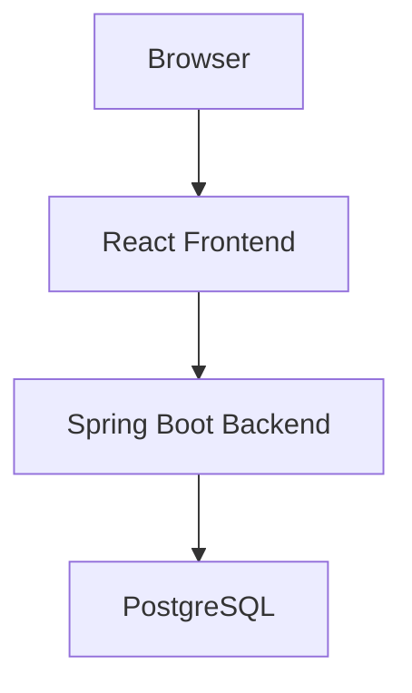
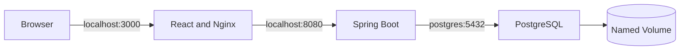
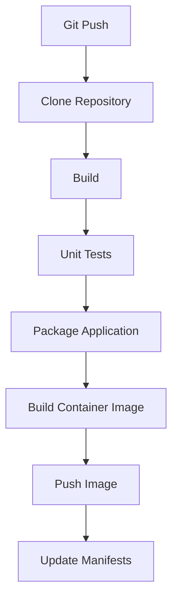
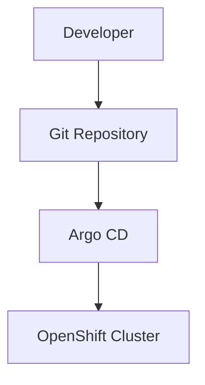
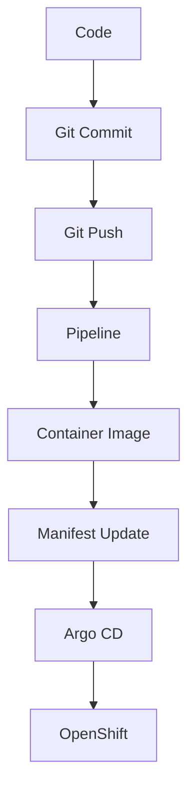

# BookStore Platform Architecture

## Project Architecture Specification

Version: 1.1

---

# Overview

BookStore Platform is the reference application used throughout the entire book.

The application evolves chapter by chapter while maintaining the same business domain. The goal is to demonstrate how a modern cloud-native application is designed, containerized, deployed, automated and operated using Kubernetes, OpenShift and GitOps.

The business functionality remains intentionally simple while the infrastructure becomes progressively more sophisticated.

---

# Architecture Principles

The project follows these principles:

- Single business domain
- Progressive evolution
- Cloud-native design
- Infrastructure as Code
- GitOps
- Production-inspired architecture
- Local-first development
- Chapter-gated implementation

The application must remain deployable on localhost throughout the entire book. Cloud providers are intentionally excluded.

Only the files and directories required by the current chapter are created. Technologies described by later chapters remain part of the target architecture but must not be scaffolded in advance.

---

# Source of Truth

The Markdown documents in the repository are the source of truth.

Implementation work must follow this order:

1. Read `PROJECT_SPEC.md`.
2. Read `ARCHITECTURE.md`.
3. Read the current chapter under `documentation/chapter_<name>/`.
4. Implement only the scope introduced by that chapter.

PDF, DOCX and HTML documents are generated artifacts and must not be edited independently from their Markdown source.

---

# Technology Stack

## Frontend

Technology:

- React
- TypeScript
- Vite

Responsibilities:

- User interface
- Authentication
- Book management
- Order management
- API consumption

Communication uses REST APIs over HTTP.

## Backend

Technology:

- Java
- Spring Boot
- Spring Data JPA
- Spring Security
- Maven

Responsibilities:

- Business logic
- REST API
- Database access
- Validation
- Authentication
- OpenAPI documentation

## Database

Technology: PostgreSQL.

Responsibilities:

- Persistent storage
- Transactions
- Relational model

Future chapters may introduce read replicas, backup strategies and Persistent Volumes.

---

# Initial System Architecture



---

# Repository Layout

```text
bookstore/
|-- PROJECT_SPEC.md
|-- ARCHITECTURE.md
|-- README.md
|-- .gitignore
|-- .env.example
|-- frontend/
|-- backend/
|-- database/
|-- infrastructure/
|   |-- docker/
|   |-- kubernetes/
|   |-- helm/
|   |-- openshift/
|   |-- tekton/
|   `-- argocd/
|-- scripts/
`-- documentation/
    |-- chapter_one/
    |-- chapter_two/
    `-- ...
```

Every directory has a single responsibility. Documentation must never be mixed with application code.

The layout above is the target layout. Directories are materialized only when introduced by a chapter:

- Chapter 1 creates application components and `infrastructure/docker/`.
- Chapter 2 introduces `infrastructure/kubernetes/`.
- Chapter 3 introduces `infrastructure/openshift/`.
- Chapter 4 introduces `infrastructure/helm/`.
- Chapter 5 introduces `infrastructure/tekton/`.
- Chapter 6 introduces `infrastructure/argocd/`.

---

# Chapter 1 Architecture

Chapter 1 runs the complete BookStore application on localhost with Docker Compose.



Rules:

- Docker Compose lives in `infrastructure/docker/`.
- The backend JAR is built before the image with `./mvnw clean package`.
- PostgreSQL readiness is verified with a health check.
- The backend waits for PostgreSQL to become healthy.
- Compose service names provide internal DNS.
- Vite `VITE_*` variables are supplied at frontend build time.
- Vite client variables must never contain secrets.
- Services intended for scaling must not declare `container_name`.
- No Kubernetes, OpenShift, Helm, Tekton or Argo CD resources are created in Chapter 1.

---

# Kubernetes Architecture

Starting from Chapter 2, the application is deployed using Kubernetes resources.

Each component will have:

- Deployment
- Service
- Labels
- Selectors
- Namespace

Later chapters introduce ConfigMap, Secret, PersistentVolume, PersistentVolumeClaim and Ingress where applicable.

---

# OpenShift Architecture

OpenShift replaces the local Kubernetes environment while preserving the application architecture.

Additional resources include:

- Project
- Route
- ImageStream where appropriate
- BuildConfig for historical context where appropriate
- Security Context Constraints

Only the platform capabilities evolve.

---

# Helm Architecture

The entire application will eventually be packaged as a single Helm chart:

```bash
helm install bookstore infrastructure/helm/bookstore
```

The chart should support configurable namespace, image versions, replica counts, resource limits and service configuration.

---

# Tekton Architecture

The CI pipeline will be implemented using Tekton.



Pipeline definitions are stored in `infrastructure/tekton/`.

---

# Argo CD Architecture

Continuous Delivery follows the GitOps model.



Argo CD continuously compares desired state with current state. Differences are reconciled automatically. Manual cluster changes are discouraged, and Git is the single source of truth.

Argo CD resources are stored in `infrastructure/argocd/`.

---

# Naming Conventions

Namespace:

```text
bookstore
```

Deployments:

```text
bookstore-frontend
bookstore-backend
bookstore-postgres
```

Services:

```text
bookstore-frontend-service
bookstore-backend-service
bookstore-postgres-service
```

Labels:

```text
app=bookstore
component=frontend
component=backend
component=postgres
environment=development
```

Images:

```text
bookstore/frontend
bookstore/backend
bookstore/postgres
```

Consistency is preferred over brevity.

---

# Project Evolution

## Version 1

- Books CRUD
- Frontend
- Backend
- PostgreSQL

## Version 2

- Authentication
- Users
- Roles

## Version 3

- Orders
- Shopping cart
- Inventory

## Version 4

- Redis cache
- Performance optimization

## Version 5

- RabbitMQ
- Messaging
- Asynchronous processing

## Version 6

- Prometheus
- Grafana
- Metrics
- Health checks

## Version 7

- Tekton
- Argo CD
- Automated delivery
- Continuous deployment

---

# Development Workflow



The workflow intentionally mirrors a production environment.

Git follows the repository GitFlow conventions:

- feature work starts from `develop`;
- feature branches use `feature/<description>`;
- feature pull requests target `develop`;
- direct pushes to `develop` and `main` are not allowed.

---

# Design Goals

The project prioritizes:

- Readability
- Simplicity
- Maintainability
- Automation
- Reproducibility

The application should never become unnecessarily complex. Business logic exists only to demonstrate cloud-native concepts, while infrastructure is the primary learning objective.

---

# Future Extensions

The architecture remains compatible with possible future additions:

- Horizontal Pod Autoscaler
- Network Policies
- Resource Quotas
- Pod Disruption Budgets
- Service Mesh
- OpenTelemetry
- External Secrets
- Sealed Secrets
- KEDA
- Multi-cluster deployments

These topics are outside the current book scope.

---

# Final Objective

By the end of the book, BookStore Platform should represent a complete, production-inspired cloud-native application.

Every technology introduced throughout the book must integrate naturally into the same architecture. No chapter requires creating a different application: the platform evolves while the business domain remains the same.
