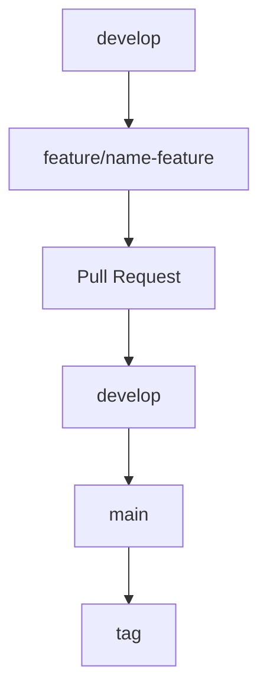
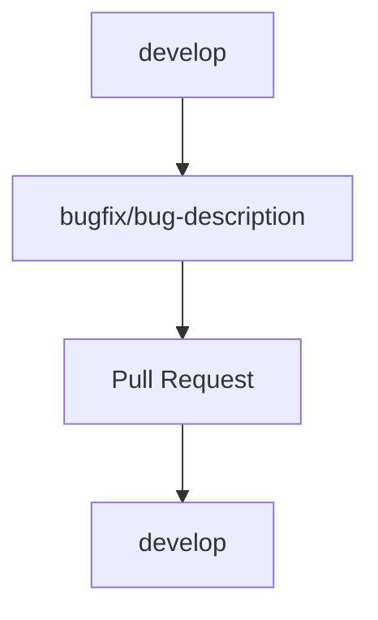
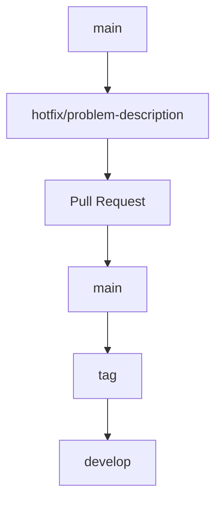

# learning-gitOps
Project for learning and make practice on localhost using GitOps approach with OpenShift, k8s, tekton, docker, argoCD, helm.

# Rule sets
Projects collaborators cannot push directly on main and develop branch.


# Versioning
Project uses semantic versioning with format MAJOR.MINOR.PATCH

EXAMPLE:
```bash
1.0.0
1.1.0
1.1.1
2.0.0
```

EXPLANATION:
- MAJOR: important changes or breaking changes;
- MINOR: new compliant features;
- PATCH: bug fix.

Every release on main branch need to be associated with Git TAG:
```bash
  git tag v1.1.0
  git push origin v1.1.0
```

# Branch strategy inspired by GitFlow strategy
This project uses a branch strategy designed to keep developments organized, manage release on production and reduce updates not verified on primary branches like main, develop.

The strategy is based on these branch:
- main
- develop
- feature/*
- bugfix/*
- hotfix/*

---

Primary branches

`main`

Main branch represents the code currently released on production. 
<br/>
<b>Main Rules</b>:
- it contains only stable codes and can be released;
- direct push is not allowed;
- force push is not allowed;
- changes arrives only through Pull Request;
- merge on main can be executed only by admin or by authorized maintainer;
- every merge into main must come from develop, `release/*` or `hotfix/*` branch;

Every version released on production must be identified by git tag, for example
```bash
  v1.0.0
  v1.1.0
```

`develop`

Develop branch represents integrated development environment. On this branch there are 
updates coming from:
- branch feature/*
- branch bugfix/*
<br/>
<b>Main Rules</b>:
- is not allowed direct push;
- updates must arrives through Pull Request;
- before merge from Pull Request must be completed some checks like build, automated tests passed successfully and code review;
- branch must always remain in working state.

When `develop` contains a set of stable feature in state ready for release, it can be merged
to `main`.

---

Working branches

`feature/*`

Features branch are used to develop new features. Naming convention:
```bash
feature/name-feature
```

Example:

feature/user-login
feature/dashboard-admin
feature/export-report

<b>Main Rules</b>:
1. create branch start from `develop`;
2. implement feature;
3. open pull request with target `develop`;
4. make with other team member code review and test;
5. make merge on `develop` after pull request is accepted by approvers;
6. delete branch after merge.

```bash
git checkout develop
git pull origin develop
git checkout -b feature/user-login
``` 

`bugfix/*`
<br/>
These branch are used for fix bug not critical, identified during development or before release.
Naming convention:
```bash
bugfix/bug-description
```

Example:

bugfix/fix-validation-form

<b>Main Rules<b/>:
1. create branch from `develop`;
2. fix bug;
3. open Pull Request with targer `develop`;
4. make with other team member code review and test;
5. make merge on `develop` after pull request is accepted by approvers;
6. delete branch after merge.
---

Branch for make hotfix on production

`hotfix/*`

These branches are used for fix critical bug on production. The difference between hotfix
and bugfix branches is that hotfix start from main because they must directly fix the code
currently released.

Naming convetion:
```bash
hotfix/hotfix-description
```

Example:

hotfix/crash-start-app

<b>Main Rules<b/>:
1. create branch from `main`;
2. fix hotfix;
3. open Pull Request with target `main`;
4. make with other team member code review and test;
5. make merge on `main` after pull request is accepted by approvers;
6. create new git tag;
7. merge fix also on `develop`.
---

Example:
```bash
git checkout main
git pull origin main
git checkout -b hotfix/fix-login-production
git tag v1.1.1
git push origin v1.1.1

git checkout develop
git pull origin develop
git merge hotfix/fix-login-production
git push origin develop

```

Pull Request

Every updates must be integrated through a Pull Request. PR must follow these rules:
- have a clear title;
- describe updates introduced;
- link task, bug of updates;
- must be reviewed at least by one team member;
- pass any build and test pipelines;
- not contains conflicts;
- not introduce unnecessary code or code unrelated to the purpose of the PR.

Example:
Feature: add user login  
Bugfix: fix form validation
Hotfix: fix login error on production 
Release: add 1.1.0 version

---

Standard development workflow

## Standard development workflow

### Feature workflow



### Bugfix workflow



### Hotfix workflow

